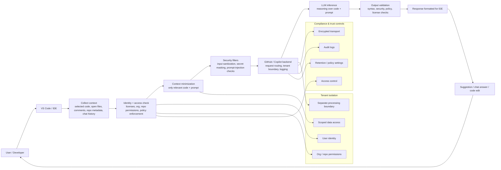

# Copilot Data Flow

## Diagram view

## What is actually happening

1. The IDE gathers the relevant context for the request.
2. Copilot verifies who the user is and what they are allowed to access.
3. The system narrows the request to the minimum required code and prompt context.
4. Security filters inspect the input for prompt-injection, sensitive content, and malformed data.
5. The request is routed through the Copilot backend, which keeps the request inside the proper tenant and org boundary.
6. The model generates a suggestion or answer based on that scoped context.
7. Output is re-checked for syntax, policy, and quality before returning to the IDE.
8. The IDE presents the result to the user, who decides whether to accept, reject, or refine it.

## Key security principles

- Least privilege: only the needed repo and code context are used.
- Tenant isolation: one customer's data is kept separate from another's.
- Policy enforcement: org and access controls are checked before processing.
- Compliance posture: encryption, auditability, and retention controls matter as much as model behavior.
- Human oversight: the user remains the final decision-maker for applying or rejecting suggestions.

## Data privacy validation by tier

GitHub Copilot privacy and data handling rules vary significantly by subscription tier. In general, Business and Enterprise plans are designed to impose stricter controls, while Individual, Free, and Pro plans may have different handling for interaction data and model improvement settings.

The important nuance is that there is no single universal rule for every Copilot plan. A safer statement is:

- Business and Enterprise plans typically enforce stronger privacy controls and stricter retention policies.
- Individual and other consumer-tier plans may allow certain interaction data to be used for product improvement unless the user opts out in settings.
- The exact behavior depends on the plan, the contract, the organization policies, and the privacy settings active for the account.

### Common claims and their correct interpretation

- "Your prompts and code are never used to train public models."
  This is broadly aligned with the intended Copilot model, but it should be stated carefully: in general, customer code is not used for public model training, yet the exact rule depends on product terms, subscription type, and account configuration.

- "Data is completely isolated inside your company's cloud environment."
  This is too absolute. A more accurate statement is that Copilot implements tenant isolation, access controls, and policy enforcement to separate customer data boundaries, while still operating within backend services that are part of the overall product infrastructure.

- "Copilot only accesses files you are already authorized to view."
  This is generally correct as a principle, but it should be framed as permission-aware processing rather than a guarantee of zero risk. Copilot works with the minimum relevant context for a request and is intended to respect repository and organization permissions.

## Practical summary

Copilot is not a single black box; it is a pipeline of:

User input -> IDE context collection -> permission checks -> scoped prompt -> security filtering -> model inference -> output validation -> IDE response.

This pipeline is what makes the experience useful while keeping data handling constrained, auditable, and governed.
